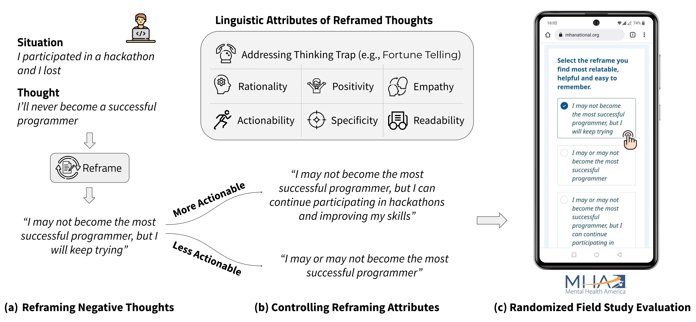

# Cognitive Reframing
This repository contains the code and dataset for the [ACL 2023 publication](https://arxiv.org/abs/2305.02466) on cognitive reframing of negative thoughts through human-language model interaction.

If this code or dataset helps you in your research, please cite the following publication:
```bash
@inproceedings{sharma2023cognitive,
    title={Cognitive Reframing of Negative Thoughts through Human-Language Model Interaction},
    author={Ashish Sharma and Kevin Rushton and Inna Wanyin Lin and David Wadden and Khendra G. Lucas and Adam S. Miner and Theresa Nguyen and Tim Althoff},
    year={2023},
    booktitle={ACL}
}
```

## Introduction
We conduct a human-centered study of how language models may assist people in reframing negative thoughts. Based on psychology literature, we define a framework of seven linguistic attributes that can be used to reframe a thought. We develop automated metrics to measure these attributes and validate them with expert judgements from mental health practitioners. We collect a dataset of 600 situations, thoughts and reframes from practitioners and use it to train a retrieval-enhanced in-context learning model that effectively generates reframed thoughts and controls their linguistic attributes. To investigate what constitutes a "high-quality" reframe, we conduct an IRB-approved randomized field study on a large mental health website with over 2,000 participants. Amongst other findings, we show that people prefer highly empathic or specific reframes, as opposed to reframes that are overly positive. Our findings provide key implications for the use of LMs to assist people in overcoming negative thoughts.




## Quickstart

### 1. Prerequisites

Our code can be compiled on Python 3 environments. The modules used in our code can be installed using:
```
$ pip install -r requirements.txt
```

This code uses OpenAI's python library. Please ensure that you set the OPENAI_API_KEY environment variable to your OpenAI API key. You can find your API key at [platform.openai.com/account/api-keys](https://platform.openai.com/account/api-keys).


### 2. Reframing
We provide the cognitive reframing dataset collected in this project at [data/reframing_dataset.csv](data/reframing_dataset.csv). The dataset contains 600 situations and thoughts with their corresponding reframes.

Our reframing code can be directly run on an input test file. The file should be a csv with a situation and a thought column.

A sample test file can be found at [data/sample_test.csv](data/sample_test.csv). To run cognitive reframing on this test file, please use the following command:

```
$ python src/reframing.py \
	--train_path=data/reframing_dataset.csv \
	--test_path=data/sample_test.csv \
	--output_path=data/sample_test_output.csv \
	--top_k=5 \
	--gpt3_model=text-davinci-003 \
	--top_p=0.6
```

### 3. Thinking Traps
We additionally provide a dataset of thinking traps associated with situations and thoughts. This dataset can be found at [data/thinking_traps.jsonl](data/thinking_traps.jsonl). 

This dataset can be used to finetune an OpenAI model using the following command:

```
$ openai api fine_tunes.create -t "thinking_traps_prepared.jsonl" -m "curie"
```